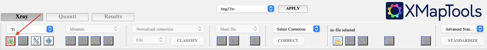
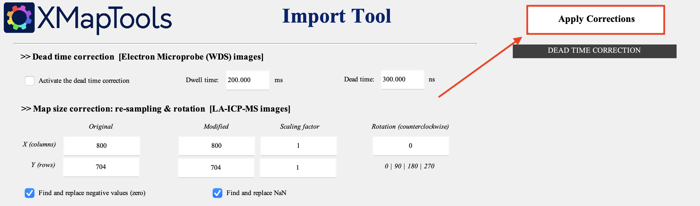
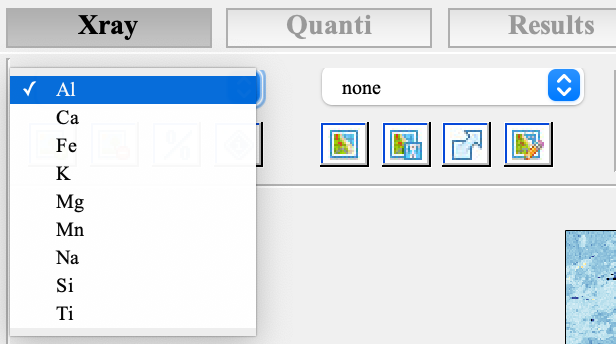
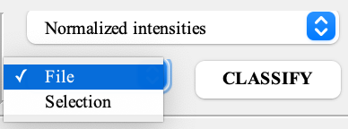
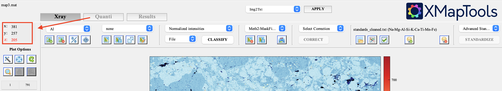
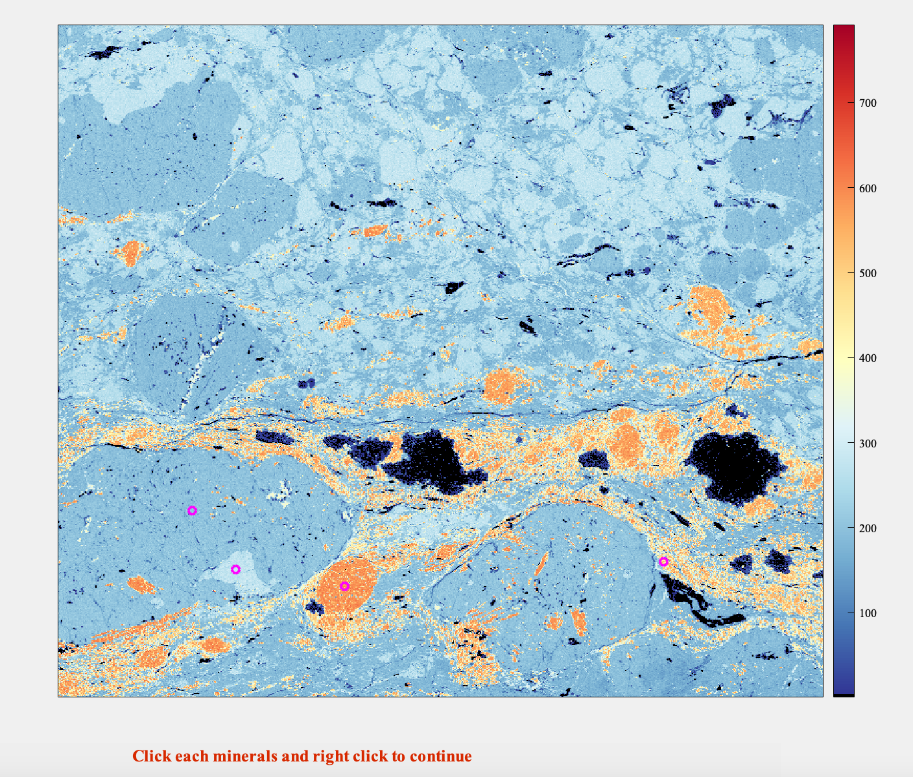

## Finding a local bulk composition with XMapTools

### Background

This tutorial is written in order to ____

This tutorial uses the following files in addition to the element maps and traverse data: 

- `map.py`
	-   Python script to clean element map data. Specifically formatted for CAMECA microprobe output. Script reads in element map text file and returns another text file with the header and left-most column removed. 
	-   Run script in the command line with the command `python <map.py file path> <raw element map file path>`.
- `Classification.txt`
	- Modified from Classification file on [XMapTools resources](https://www.xmaptools.com/additional-tools-files/). 
	- Includes space to add mineral densities. Make sure that the density data is in the same order as the list of minerals from `>1`. Density data from [WebMineral](http://www.webmineral.com/).
-   `XMapToolsCoordinatesTool.xls`
	- Excel spreadsheet to calculate image coordinates from the center point coordinates. Modified from [XMapTools resources](https://www.xmaptools.com/additional-tools-files/).
- `Standards.txt`
	- Text file contains image coordinates calculated by `XMapToolsCoordinatesTool.xls` and traverse data. Modified from Standards file on [XMapTools resources](https://www.xmaptools.com/additional-tools-files/).


The `map.py`, `Classification.txt`, `XMapToolsCoordinatesTool.xls`, and `Standards.txt` files can be found on the [XMapTools home page](https://www.xmaptools.com/additional-tools-files/) but are also in the [Github](https://github.com/jannittayao/XMapTools-local-bulk-comp) repository that this page is hosted on for your convenience.


### Step 1. Process and Import Element Maps

**1.0 Optional:** Use `map.py` to clean raw element map data. 

**1.1** Use the Import Map button to import all of the cleaned .txt files. All element maps need to have the file name `<element>.txt` where `<element>` is one of the available element names: Na, Mg, Al, Si, P, S, Cl, K, Ca, Ti, V, Cr, Mn, Fe, Co, Ni, Cu,
Zn, Zr, Ag, Cd, Sn, Ce, As, Sb, Cs, La, Nd, Pb, Sr, Th, U, Yt (which is ytterbium and not the "Y" coordinate), Sm, Gd, Dy, Pr. 

 

Edit `XMapToolsSetupDirectory/Program/Dev/Xmap_Default.txt` to add elements to the default element names. For more information on accepted map file formats and names, refer to **Section 2.7.3 Map Files** in the [XMapTools User Guide](https://www.xmaptools.com/XMapTools.3.4_UserGuide.pdf). 😎

**1.2** Hit the 'Apply Corrections' button in the Import Tool window that pops up. 

 

**1.3** After all of the maps have been imported and corrected, you can toggle between the different element maps in the drop-down menu. 

 


### Step 2. Classify Minerals

Next, classify the main minerals identified in the composition maps. There are two main ways of classifying minerals: by file and by selection. Both work well for our purposes, but XMapTools can be buggy and crash at odd times, so the file option might be best for unexpected crashes. 

 

#### Classifying by file

To classify minerals by file, download and edit the `Classification.txt` file. Under `>1`, include identified minerals and approximate coordinates for a point in each mineral (X/Y coordinates of each point can be found on the left side bar). Under `>2`, include the densities of the minerals in the **same order** as the list in `>1`. 

 

After selecting the File option, select the edited `Classification.txt` to load the classifications. 

#### Classifying by selection 

To classify minerals by selection, left-click on your preferred element map to select all of the identified minerals, then right-click to generate a classified mineral map. 

 

Rename the minerals after generating the classified mineral map. 

### Step 3. Import Standards

The next step is to import standards for spot analyses to allow XMapTools to perform analytical standardization and transform each phase's x-ray map into maps of weight percent oxide concentration.

**3.1** Change and edit the 

- perform spot analyses 
- change and edit the standards file 
- standardize the x-ray map intensities to oxide composition
- Import standards button 
- display the spot analyses with the Display/Hide standards button 
- For more information on how the spot analyses work refer to **Section 3.8.5 Internal Standards (spot analyses)** on the XMapTools User Guide.

### Step 4. Standardize Minerals

- 

### Step 5. Generate Density Map 

### Step 6. Export Local Bulk Composition

```markdown
Syntax highlighted code block

# Header 1
## Header 2
### Header 3

- Bulleted
- List

1. Numbered
2. List

**Bold** and _Italic_ and `Code` text

[Link](url) and 
```


