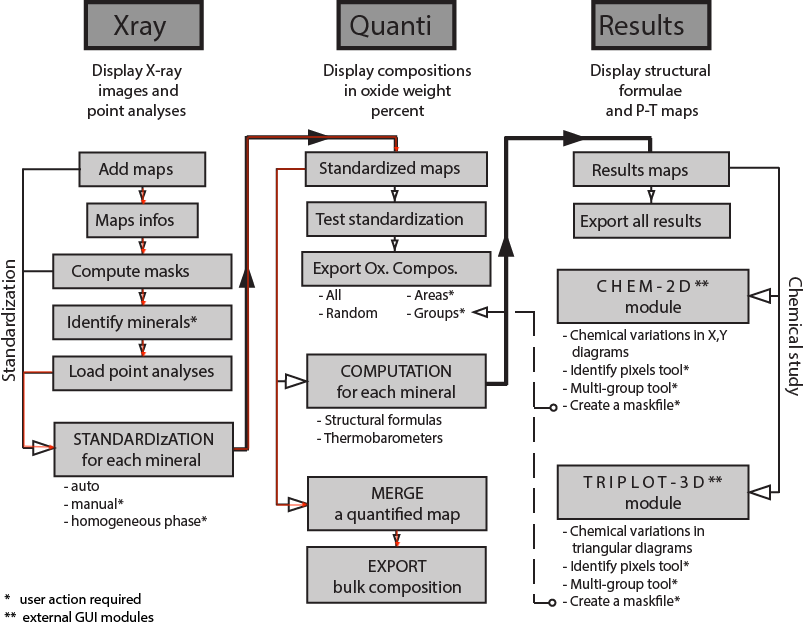
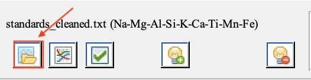

## Finding a local bulk composition with XMapTools

### Background

This tutorial serves as a walkthrough for using XMapTools to find the local bulk composition of a thin-section from x-ray element maps. 

[XMapTools](https://www.xmaptools.com/) is run on [MATLAB](https://www.mathworks.com/products/matlab.html) and is developed by Dr. Pierre Lanari. For more information on how to set up and run XMapTools from the MATLAB command window, refer to Section 2 from the [XMapTools User Guide](https://www.xmaptools.com/XMapTools.3.4_UserGuide.pdf).

 
This figure is adapted from the XMapTools site. Red arrows point to the workflow outlined in this tutorial. 

This tutorial uses the following files in addition to the element maps and traverse data: 

- `map.py`
	-   Python script to clean element map data. Specifically formatted for CAMECA microprobe output. Script reads in element map text file and returns another text file with the header and left-most column removed. 
	-   Run script in the command line with the command `python <map.py file path> <raw element map file path>`.
- `Classification.txt`
	- Modified from Classification file on [XMapTools resources](https://www.xmaptools.com/additional-tools-files/). 
	- Includes space to add mineral densities. Make sure that the density data is in the same order as the list of minerals from `>1`. Density data from [WebMineral](http://www.webmineral.com/).
-   `XMapToolsCoordinatesTool.xls`
	- Excel spreadsheet to calculate image coordinates from the center point coordinates. Modified from [XMapTools resources](https://www.xmaptools.com/additional-tools-files/).
- `Standards.txt`
	- Text file contains image coordinates calculated by `XMapToolsCoordinatesTool.xls` and traverse data. Modified from Standards file on [XMapTools resources](https://www.xmaptools.com/additional-tools-files/).

The `map.py`, `Classification.txt`, `XMapToolsCoordinatesTool.xls`, and `Standards.txt` files can be found on the [XMapTools resources page](https://www.xmaptools.com/additional-tools-files/) but are also in the [Github](https://github.com/jannittayao/XMapTools-local-bulk-comp) repository that this page is hosted on for your convenience.

### Step 1. Process and Import Element Maps

**1.0 [Optional]:** Use `map.py` to clean raw element map data. 

**1.1** Use the Import Map button to import all of the cleaned .txt files. All element maps need to have the file name `<element>.txt` where `<element>` is one of the available element names: Na, Mg, Al, Si, P, S, Cl, K, Ca, Ti, V, Cr, Mn, Fe, Co, Ni, Cu,
Zn, Zr, Ag, Cd, Sn, Ce, As, Sb, Cs, La, Nd, Pb, Sr, Th, U, Yt (which is ytterbium and not the "Y" coordinate), Sm, Gd, Dy, Pr. 

 

Edit `XMapToolsSetupDirectory/Program/Dev/Xmap_Default.txt` to add elements to the default element names. For more information on accepted map file formats and names, refer to **Section 2.7.3 Map Files** in the [XMapTools User Guide](https://www.xmaptools.com/XMapTools.3.4_UserGuide.pdf). 

**1.2** For each imported map, hit the 'Apply Corrections' button in the Import Tool window that pops up. 

 

**1.3** After all of the maps have been imported and corrected, you can toggle between the different element maps in the drop-down menu. 

 

### Step 2. Classify Minerals

Next, classify the main minerals identified in the composition maps. There are two main ways of classifying minerals: by file and by selection. Both work well for our purposes, but XMapTools can be buggy and crash at odd times, so the file option might be best for unexpected crashes. 

 

#### Classifying by file

To classify minerals by file, download and edit the `Classification.txt` file. Under `>1`, include identified minerals and approximate coordinates for a point in each mineral (X/Y coordinates of each point can be found on the left side bar in XMapTools). Under `>2`, include the densities of the minerals in the **same order** as the list in `>1`. Densities can be found from [WebMineral](http://www.webmineral.com/).

 

After selecting the File option, select the edited `Classification.txt` to load the classifications. 

#### Classifying by selection 

To classify minerals by selection, left-click on your preferred element map to select all of the identified minerals, then right-click to generate a classified mineral map. 

 

Rename the minerals after generating the classified mineral map. 

### Step 3. Import Standards

The next step is to import standards for spot analyses to allow XMapTools to perform analytical standardization and to transform each phase's x-ray map into maps of weight percent oxide concentration. For our purposes, spot analyses represent garnet transects in our thin section.

**3.1** Download and edit `XMapToolsCoordinatesTool.xls` to find image coordinates based on the microprobe used. 

**3.2** Copy the image coordinate output into Section `>1` in `Standards.txt`. In Section `>2`, paste the oxide order as displayed on the oxide table generated by the microprobe, followed by "X" and "Y" for the pixel coordinates. In Section `>3`, paste the oxide and coordinate information. 

**3.3** Import the standards into the project. Click the Import Standards button and select the edited `Standards.txt`. 

 

**3.4** Once the standards are imported, display the traverse spot analyses with the Display/Hide standards button. 

For more information on how the spot analyses work refer to **Section 3.8.5 Internal Standards (spot analyses)** on the [XMapTools User Guide](https://www.xmaptools.com/XMapTools.3.4_UserGuide.pdf).

### Step 4. Standardize Minerals

After importing the spot analysis data, standardize each mineral based on the standards file. 

**4.1** For each mineral from the drop-down menu of the classified minerals as defined in Step 2, select Standardize. Choose to standardize all of the element maps. 

 

**4.2** In the pop-up window, for each element in the drop-down menu, calibrate the element by selecting the appropriate type of calibration (None, Automated, Manual) and then selecting Apply Auto. Once all of the elements have been calibrated and display ** OK ** in the drop-down, select Apply Standardization. Repeat this process for all of the minerals. 

 

For more information on standardization refer to **Section 3.8.6 Standardization** on the [XMapTools User Guide](https://www.xmaptools.com/XMapTools.3.4_UserGuide.pdf).

### Step 5. Generate Density Map

After all of the minerals have been standardized, select Transfer to Quanti for each mineral in the drop-down menu located in the upper right. Select No when asked about transformations. 

After all of the mineral maps have been transferred to Quanti, select the Quanti tab on the top to toggle to the Quanti workspace. 

Merge the mineral Quanti files with the Merge Quanti Files button. Select all of the mineral files. 

Once mineral files have been merged, select the Generate a density map button. 

 

### Step 6. Export Local Bulk Composition

Once a density map has been generated, choose either Select an Area & Eliminate Pixels Outside or Select An Area & Eliminate Pixels Inside to cut out your local area of choice. 

Select the Export Local Composition: Area button to export your local bulk composition. 

 

